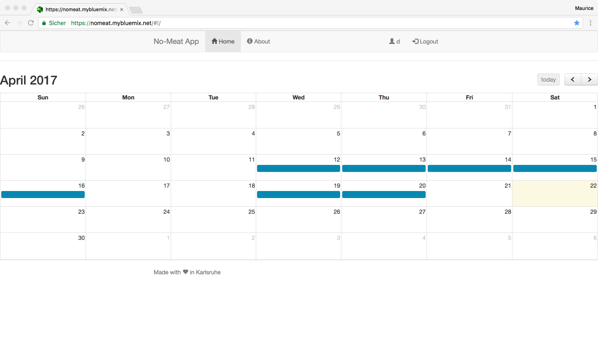

# Capstone Project of Coursera's Full Stack Webdevelopment Course
[https://www.coursera.org/specializations/full-stack](https://www.coursera.org/specializations/full-stack)



## Stack Overview

### Frontend

- HTML + CSS + JavaScript
- Generated with [yo angular generator](https://github.com/yeoman/generator-angular) version 0.15.1
- Angular 1.x
- [angular-ui-calendar](https://angular-ui.github.io/ui-calendar/)
  - Based on [Fullcalendar](https://fullcalendar.io/docs/)
- [json-server](https://github.com/typicode/json-server) for testing
  - `cd frontend/json-server && json-server db.json`

### Backend

- Generated by [LoopBack](http://loopback.io)
- NodeJS
- MongoDB

## Set up for using SSL certificate

```
$ cd server/private
$ openssl genrsa -out privatekey.pem 1024
$ openssl req -new -key privatekey.pem -out certrequest.csr
$ openssl x509 -req -in certrequest.csr -signkey privatekey.pem -out certificate.pem
```

- More about this: https://loopback.io/doc/en/lb2/Preparing-for-deployment.html#generate-your-own-ssl-certificate

## Run locally

1. `npm install`
2. `cd client && bower install && npm install`
3. `cd mongodb && mongod --dbpath=data`
4. `node .`
5. `cd client && grunt serve` (for preview) or `grunt` (for building)

### Frontend Testing

Running `grunt test` will run the unit tests with karma.

## Deployment

- Deployed on [IBM Bluemix Cloud Foundry](https://www.ibm.com/cloud-computing/bluemix/)
- Cloud Database: [IBM Cloudant](https://cloudant.com/)
- `cd client && grunt build`
- `cf push "No Meat"`

## Roadmap

- [x] Deploy on ~~Heroku or~~ IBM Bluemix
- [ ] Landing page
- [ ] After logout forward to landing page
- [x] Show positive days on calendar after login w/o site reload
- [ ] Restrict model ACLs
- [ ] Counter for positive days per month
- [ ] Hybrid mobile app with Ionic + Cordova
- [ ] 'Change Password'
- [ ] 'Delete Account'
- [ ] Login with email address
- [ ] Add more calendars to track different habits
